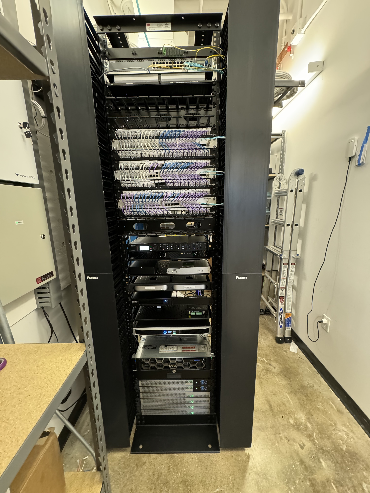
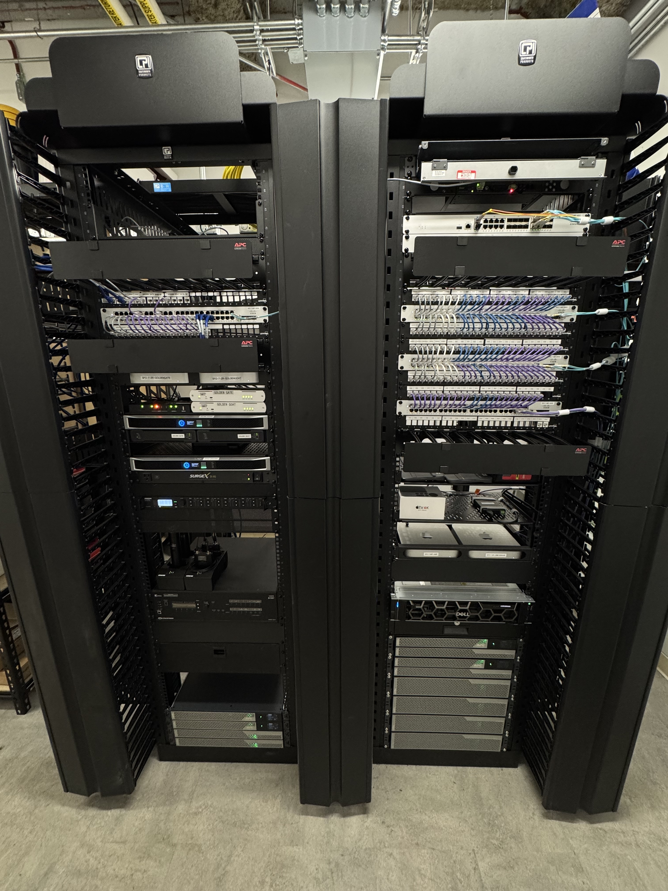
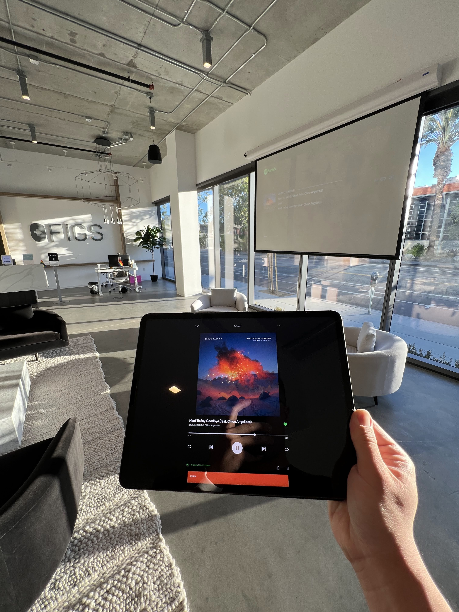
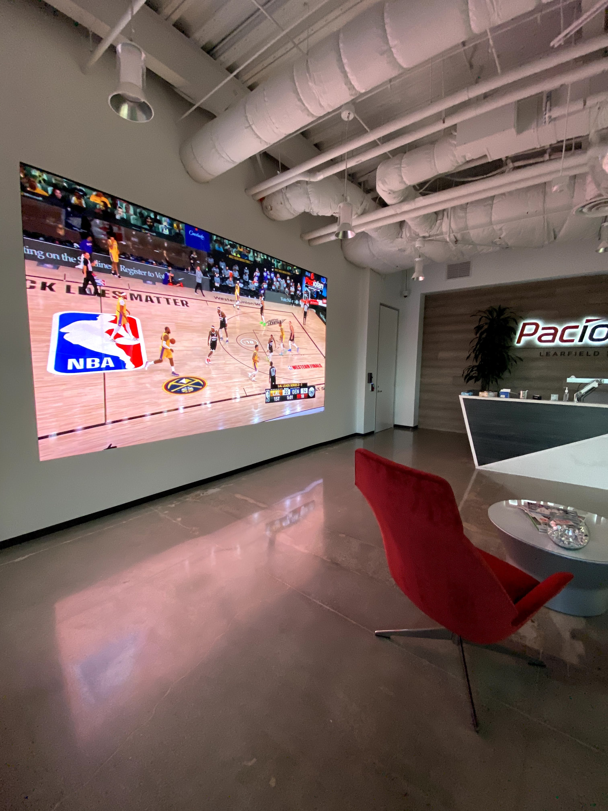
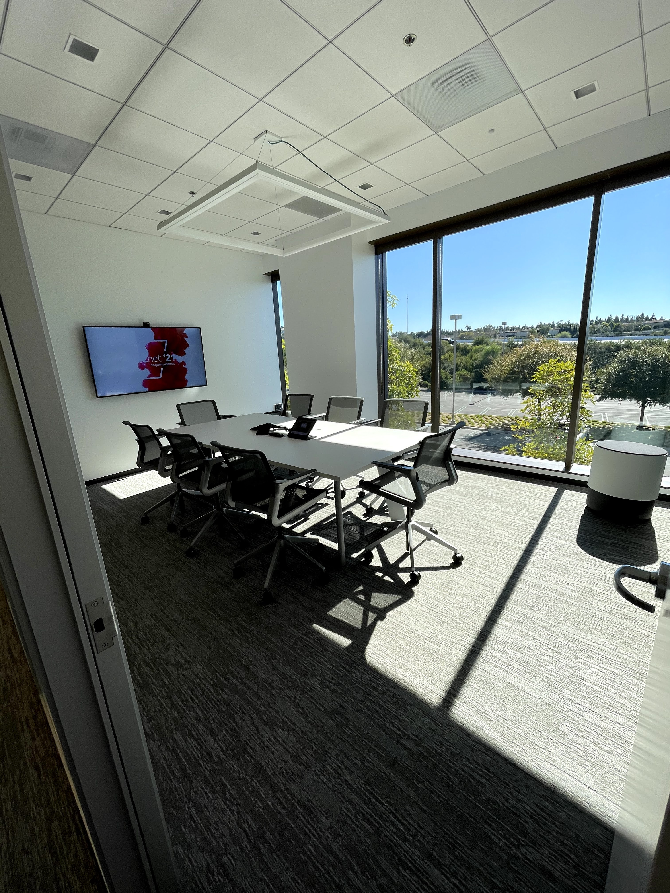
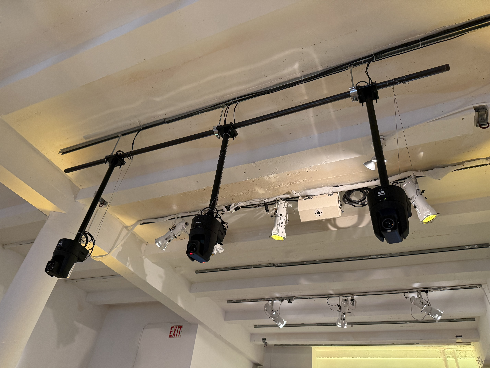
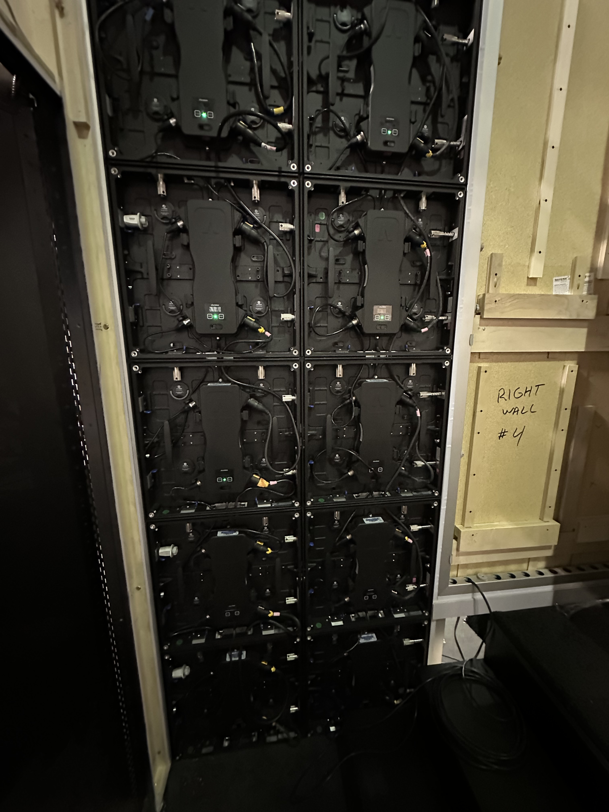
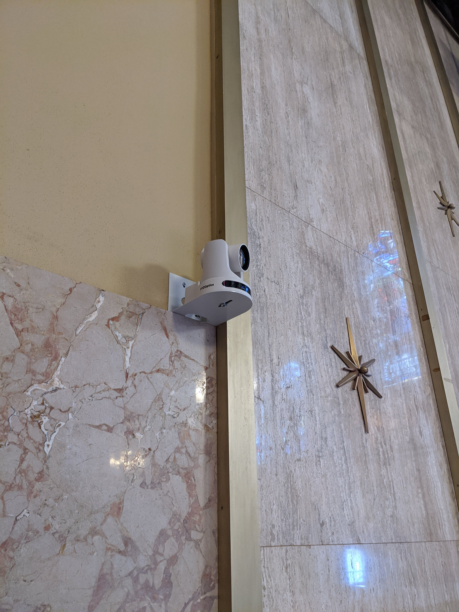

## Certifications

- Dante Level 2 Certified
- Q-SYS Level 1 Certified
- Shure IntelliMix Technical Enablement
- Shure DSP Technical Enablement

[Download my resume (PDF)](/Vu_Dennis_Resume_public.pdf) or [connect with me on LinkedIn](https://linkedin.com/in/dennisvu).

## Whatnot
### New York (SoHo) Office

#### Technologies 
- Samsung QLED 4K UHD Displays
- Sony Laser Projectors
- Q-SYS Core control systems
- Logitech Tap Scheduler Room Signage
- Logitech Rally Pan-Tilt-Zoom cameras
- Cisco Meraki Wireless Access Points
- Verkada 4K security cameras
- Shure MXA in-ceiling array microphones
- Shure ULX-D wireless handheld and worn microphones
- Shure IntelliMix digital signal processors
- Biamp Desono, Sonance Professional pendant speakers and subwoofers
- Visionary Duet AVoIP network video transport
- Dante audio routing
- Atlas IEM, LEA Professional powered amplifiers
- Zoom Rooms Host on Mac Mini
- Zoom Rooms Controller on iPad Air with wireless charging docks
- All endpoints controlled via mobile device management

#### Gallery

<em>Executive boardroom with ceiling-hung pendant speakers and beamforming microphones hidden above architectural elements.

Conference room with ceiling-hung pendant speakers and beamforming microphone complimenting industrial design style of the room.

Lounge and all-hands presentation area. Laser projector optimized for viewing in ambient lighting conditions displayed on an automated motorized screen. Ceiling-hung pendant speakers, subwoofers, and microphones provide audio reinforcement throughout the space. Digital signage showing live content and remote-control cameras with integrated switching mounted to structual beams to provide immersion.

Magnetically mounted iPad provides wireless charging and easy controls of the all-hands space. Wall mounted HDMI and Bluetooth connection points allow presenters with flexible sharing options in addition to wireless display casting.

Centralized network room with networking infrastructure, speaker amplification, wireless microphone receivers, Q-SYS Core control systems, digital signage host devices, Dante digital signal processors, AVoIP video transmission systems, Zoom Rooms soft codec host devices, and far-end USB bridging devices on lithium ion battery backup.
</em>

### Los Angeles (Culver City) Office

#### Technologies 
- LG NanoCell & Samsung QLED 4K UHD Displays
- Sony Laser Projectors
- Q-SYS Core control systems
- Logitech Tap Scheduler Room Signage
- Logitech Rally Pan-Tilt-Zoom cameras
- Cisco Meraki Wireless Access Points
- Verkada 4K security cameras
- Shure MXA in-ceiling array microphones
- Shure ULX-D wireless handheld and worn microphones
- Shure IntelliMix digital signal processors
- Sonance Professional pendant speakers and subwoofers
- Biamp Parle all-in-one video conferencing bar
- Visionary Duet AVoIP network video transport
- Dante audio routing
- LEA Professional powered amplifiers
- Zoom Rooms Host on Mac Mini
- Zoom Rooms Controller on iPad Air with wireless charging docks
- Apple TV 4K
- All endpoints controlled via mobile device management

#### Gallery

<em>Lounge area with ceiling-hung pendant speakers & subwoofers, acoustic reinforcements, beamforming microphones, and laser projector optimized for viewing in ambient lighting conditions. Digital signage, room scheduling displays, and remote-control cameras wall mounted throughout the space.

Breakroom area with ceiling-hung pendant speakers & subwoofers and 360-degree surveillance cameras discretely mounted to blend in with building's industrial design.

Ceiling-hung pendant speakers and acoustic reinforcement placed above workstations to provide ambiance and paging capabilities over Dante.

Digital signage, surveillance, and room scheduling devices in reception and waiting area.

Apple TV connected to displays in collaboration areas, allowing employees to wirelessly screen share.

Junior boardroom with ceiling-hung beamforming microphone and acoustic reinforcecments. Remote-control camera and soundbar wall mounted to primary display. iPad acting as control device on a wireless charging dock.

Conference room with wall-mounted display and Biamp Parle all-in-one video conferencing bar; privacy mode engaged on bar.

Conference room with wall-mounted display and Biamp Parle all-in-one-video conferencing bar, iPad acting as control device on a wireless charging dock.

Systems cabinet containing managed PoE switch, audio amplification, wireless microphone receiver for paging, digital audio interface for network streaming, environmental monitoring, and battery backup.
</em>

### San Francisco (SoMa) Office

#### Technologies 
- Samsung QLED 4K UHD Displays
- Sony Laser Projectors
- Crestron control systems
- Logitech Tap Scheduler Room Signage
- Logitech Rally Pan-Tilt-Zoom cameras
- Cisco Meraki Wireless Access Points
- Verkada 4K security cameras
- Shure MXA in-ceiling array microphones
- Shure ULX-D wireless handheld and worn microphones
- Shure IntelliMix digital signal processors
- Sonance Professional pendant speakers and subwoofers
- Crestron in-ceiling speakers
- Biamp Parle all-in-one video conferencing bar
- Visionary Duet AVoIP network video transport
- Dante audio routing
- LEA Professional powered amplifiers
- Zoom Rooms Host on Mac Mini
- Zoom Rooms Controller on iPad Air with wireless charging docks
- Apple TV 4K
- All endpoints controlled via mobile device management

#### Gallery

<em>iPad acting as control device on a wall-mounted wireless charging dock.

Samsung display and Logitech remote-control camera in boardroom.

In-ceiling speakers and beamforming microphones installed discretely in drop ceiling.

Centralized network room with networking infrastructure, speaker amplification, wireless microphone receivers, Crestron control systems, digital signage host devices, Dante digital signal processors, AVoIP and HDBaseT video transmission systems, Zoom Rooms soft codec host devices, and far-end USB bridging devices on lithium ion battery backup.
</em>

## FIGS

### Santa Monica Headquarters

#### Technologies 
- LG 4K UHD Displays
- Sony Laser Projectors
- RTi Control systems
- AVer Pan-Tilt-Zoom cameras
- Cisco Meraki Wireless Access Points
- Cisco Meraki MV security cameras
- Shure MXA in-ceiling array microphones
- Shure SLX wireless handheld microphones
- Shure IntelliMix digital signal processors
- JBL Control pendant and in-ceiling speakers
- Episode Speakers soundbars
- Zoom Rooms Host on Mac Mini
- Zoom Rooms Controller on iPad with wireless charging docks
- All endpoints controlled via mobile device management

#### Gallery

<em>Reception and all-hands presentation area. Laser projector optimized for viewing in ambient lighting conditions recessed into false ceiling, shown on automated motorized projection screen. Ceiling hung pendant speakers blended in with industrial architectural design. Remote-control camera, beamforming microphone, in-ceiling speakers, wireless networking, and surveillance equipment mounted to false ceiling.

Reception and all-hands area, alternative angle.

Networked audio available for receptionist to play ambient music. System controllable via iPad with custom RTi interface.

Close-up of ceiling hung remote-control camera, beamforming microphone, wireless access point, and surveillance camera along with maintenance access hatch.

iPad running RTi Control application.

Boardroom with LG display, soundbar wall mounted. Sound reinforcement designed to match lighting elements in ceiling. iPad acting as controller on wireless charging dock along with softphone and microphone on desk.

Boardroom with iPad acting as controller on wireless charging dock. Laptop currently wireless screen sharing to room's AV system.

Junior boardroom with auxiliary display brought in for additional content sharing. LG display and soundbar wall mounted. Sony display on rolling cart.

Reception area AV control equipment in centralized network room. RTi controller, amplifier, Shure SLX receivers, Mac mini, and Shure DSP shown.
</em>

## Paciolan

### Irvine Headquarters

#### Technologies 
- Sub-2mm pixel pitch LED video walls
- Samsung 4K UHD & Viewsonic FHD Displays
- Crestron Control systems
- AVer Pan-Tilt-Zoom and stationary cameras
- Cisco Meraki Wireless Access Points
- Shure MXA in-ceiling array microphones
- Biamp TesiraFORTE digital signal processors
- Crestron in-ceiling speakers
- Polycom VoIP phones
- Vaddio AV bridge
- Dante networking
- Zoom Rooms Host on Mac Mini
- Zoom Rooms Controller on iPad, Crestron custom interface

#### Gallery

<em>100-inch 16:9 direct-view LED video wall. iPhone XR for scale below.

Demo live broadcast content streamed to video wall.

Performing maintenance on modular video wall panels (upper right, bottom left corners; upper left area).

Boardroom with Samsung display and remote-control camera mounted on wall. Polycom VoIP phone and Crestron control tablet on desk.

Boardroom view from outside. In-ceiling speakers and beamforming microphone installed within ceiling tile grid.

Polycom VoIP phone and Crestron control tablet routed into desk connection area.

Boardroom control system with Biamp DSP, IntelliMix audio interfrace, cable box, Crestron and Vaddio AV controls, and Dante network.

Conference room with Polycom VoIP phone and iPad as Zoom Room controller.

Conference room with Polycom VoIP phone and iPad as Zoom Room controller. Samsung TV and AVer camera mounted on wall.

Conference room with Polycom VoIP phone and iPad as Zoom Room controller. Samsung TV and AVer camera mounted on wall.

Client training room with dual Viewsonic displays in mirrored mode. AVer camera and iPad acting as Zoom Room controller mounted on wall.

Client training room, alternative angle with connected podium for presenter.
</em>

## Live Broadcast

### PYLUSD Graduations

#### Technologies 
- 4K UHD HDR broadcast trucks
- Broadcast grade cameras
- Panasonic Pan-Tilt-Zoom cameras
- Direct-view LED video walls
- NewTek TriCaster production switcher
- Blackmagic Design and AJA Recording
- DiGiCo and Yamaha digital mixing boards

#### Gallery

<em>Inside broadcast truck during graduation ceremony.

Inside broadcast truck during graduation ceremony.

Exterior of broadcast truck.

Secondary broadcast truck at different site during graduation ceremony.

Tertiary broadcast truck during graduation ceremony.

Media backup and audio routing station.

Digital snake for AV transport over analog and digital media.

Broadcast grade cameras on field, on raised platforms.

Closeup of one broadcast grade camera on field, on raised platform.

Remote-control cameras deployed in addition to manned camera positions.

Additional remote-control cameras deployed in discrete locations (onstage behind board of trustees). Digital LED video wall in view.

Front-of-house sound mixing for in-person attendance.

Distributed wireless microphone antennas.

Direct view LED video walls for in-person attendance.
</em>

### Whatnot Marketing

#### Technologies 
- Sub-2mm pixel pitch LED video walls
- Canon UHD Pan-Tilt-Zoom Cameras and remote controllers
- Blackmagic Design switching, recording, routing devices
- Dell UltraSharp displays
- Resolume Arena
- Open Broadcast Software (OBS) Studio
- Proprietary, bespoke software & internal tooling
- Dante audio transport for FOH and livestream audio routing
- Shure ULX-D wireless handheld and worn microphones
- Behringer X32 Rack with Dante expansion card
- QSC K12.2 and Turbosound iNSPIRE front-of-house speakers
- Visionary Duet AVoIP video transport
- Visionary Server for digital signage management
- Ubiquiti Networks UniFi networking core

#### Gallery

<em>120+ foot long LED digital video wall for "sports-book" style theme and leaderboards.

Main broadcast and in-person stage. Digital signage on vertical displays throughout booth. Main video wall displaying content.

Behind-the-scenes input signal switching display.

Distributed compute for live data analytics and realtime video streaming in segments for high availability.

Networking and audiovisual transport control. Networking rack contains a full-stack UniFi network with high availability WAN uplinks. Network rack contains Behringer X32 Rack for routing and mixing, Shure ULX-D wireless microphone receiver for FOH and broadcast audio via Dante. AVoIP rack contains redundant Mac Studio computers for Visionary AVoIP server and data distribution systems.

Canon PTZ cameras ceiling hung for "Sportscenter" style broadcast views.

Digital video wall showing promotional content.

Digital video wall during buildout process.

Behind-the-scenes view of video wall grid array with panel interconnects.

Bespoke vintage theme promotional array using real CRT displays and custom signal processing tools.
</em>

### Freelance Worship

#### Technologies 
- NewTek TriCaster
- Open Broadcast Software (OBS) Studio
- Panasonic Pan-Tilt-Zoom cameras and controllers
- PTZoptics Pan-Tilt-Zoom cameras and controllers
- Dante audio routing
- FL Studio
- ProPresenter NDI graphics

#### Gallery

<em>Live broadcast studio at Christ Cathedral, Orange County, CA.

Panasonic PTZ remote controller during celebration, Christ Cathedral, Orange County, CA.

Live broadcast studio at Saint Boniface Church, Anaheim, CA.

Live broadcast studio at Saint Boniface Church, Anaheim, CA.

Installed PTZoptics camera at Saint Boniface Church, Anaheim, CA.
</em>